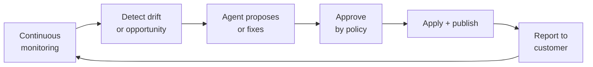
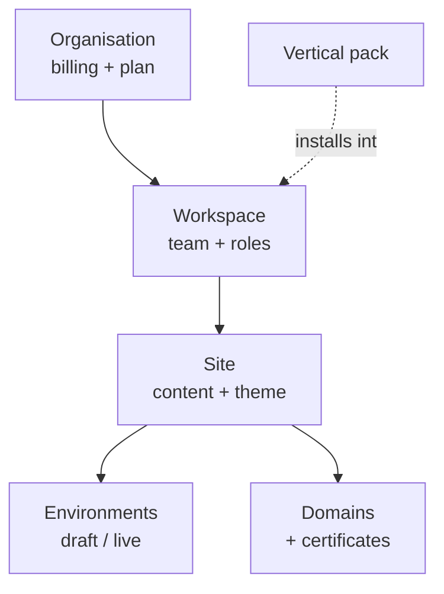
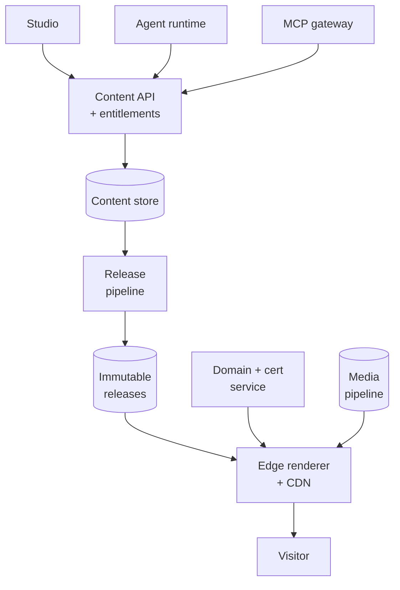
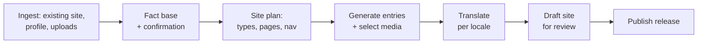

# Hotelier Website Platform — Solution Definition

Sep 22, 2026 · @Someone

*Solution definition and target architecture for the multi-tenant website platform: studio, agentic layer, hosting and delivery. The core stays industry-neutral; hotels are the launch segment and the first vertical pack. Updated 23 September 2026 with the proof-of-concept results.*

## Solution statement

Website-as-a-Service: the customer does not buy a website project, they subscribe to a website that is built, hosted and continuously kept current on their behalf.

At signup an agent generates a complete site from the customer's business — structure, content, media, translations, structured data. It goes live on their domain on managed hosting. From then on the platform operates it: content stays current, performance and accessibility stay within budget, metadata and structured data stay correct, security and template updates ship centrally, and the customer is told what was done. The customer can edit anything in the studio, and their own agents can drive it over MCP, but neither is required for the site to stay good.

The agent is what makes this economic. Continuously managed websites have always existed — as agency retainers priced by the hour, which is why small businesses cannot buy them. Running that service through an agent, with humans handling only exceptions, is the whole proposition.

Industry specialisation is packaging, not product. Hotels, restaurants, clinics and the rest arrive later as packs of content types, templates and connectors on an unchanged core.

Go-to-market is vertical even though the core is not. **Hotels first**: the first twenty customers are hotels, the hotel pack is the first pack and is built from their demand, and the PMS, booking engine and distribution owned by other xedge teams are the differentiator no horizontal builder can copy. Decided 22 September 2026.

**What it is**

- A managed service delivered by software: the subscription buys an operated website, not a tool
- A horizontal, multi-tenant platform: studio, CMS, hosting, domains, CDN
- Generation-first and maintenance-first; the agent builds it and then keeps it
- Agent-native throughout: bring your own model, MCP in and out, approvals and audit
- Evergreen by construction — template upgrades ship to live sites, so the site never becomes legacy
- Extensible by vertical packs, so a hotel product is configuration plus connectors

**What it is not**

- Not a DIY builder the customer is left alone with; self-service is available, not required
- Not a one-off build with hosting attached
- Not an agency retainer priced by human hours
- Not a hotel-only codebase: hotels are the launch pack, and no industry concept enters the core model
- Not a design tool — there is no free-positioning canvas
- Not a headless CMS; the platform renders, hosts, serves and operates the sites it builds

## Problem and context

The website builder market is mature and crowded, and every incumbent now ships AI generation. Entering it requires a clear answer to why another one should exist.

What the incumbents are:

| Category | Examples | Strength | Structural weakness |
| --- | --- | --- | --- |
| Mass builders | Wix, Squarespace | Distribution, template breadth, brand | Generic output, weak content modelling, agents bolted on |
| Designer tools | Webflow, Framer | Design control, developer respect | Steep learning curve, not self-serve for non-designers |
| Headless CMS | Sanity, Contentful, Storyblok | Structured content, strong APIs, real MCP support | No hosting, no studio for end customers, developer-required |
| Vibe-coding tools | Lovable, Bolt and similar | Speed from prompt to something running | Output is a codebase, not a maintainable managed site |

The gap sits between the last two rows. Headless platforms have structured content and agent interfaces but need a developer and host nothing. Mass builders host everything but treat content as page decoration, which makes real agent operation impossible.

The position worth taking: **structured content underneath, managed hosting on top, an agent as the primary author, and the whole thing operable by the customer's own agents.** A page is not a canvas of boxes; it is a composition of typed entries an agent can reason about, publish and revise safely.

Two conditions make this the right time. Generation quality has crossed the line where a site can be produced from data rather than designed from a brief. And MCP has made "the customer's agent operates my platform" a concrete integration rather than a slogan.

The honest risk: generation alone is already commodity. Defensibility has to come from structured content, safe autonomous operation and the hosting the incumbents' AI features sit on top of.

## Users and jobs to be done

Five user types, with different frequencies and very different tolerance for complexity. The studio must serve the first two without the others' features leaking into their view.

| User | Frequency | What they need to do |
| --- | --- | --- |
| Site owner (primary) | Monthly | Get a site live, change content, see that it works |
| Editor or marketer | Weekly | Publish posts and pages, manage media, run campaigns |
| Agency or partner | Daily | Build and manage many client sites, review before handover |
| Developer or integrator | Occasional | Extend content types, wire APIs and webhooks, drive it by agent |
| Internal ops and support | Daily | Diagnose a tenant, inspect a publish, reverse a bad change |

The jobs, in customers' own terms:

1. **"Get me online without hiring anyone."** A credible, correct site without a designer, a developer or an agency retainer.
2. **"Keep it from going stale."** Content that stays current without becoming a weekly chore.
3. **"Be found."** Ranked by search engines and cited by answer engines; this is the outcome, the site is the means.
4. **"Don't let me break it."** Confidence that any change is reversible.
5. **"Let my tools drive it."** For the sophisticated minority: operate the platform from their own agents and systems.

Three design consequences. Content editing must work on a phone, because owners are rarely at a desk. Every destructive action needs a visible undo, because fear of breaking things suppresses use and unused sites churn. And developer capability must be additive rather than present by default, or the primary user drowns.

Explicit non-user for v1: the visual designer who wants a canvas. Serving them compromises responsiveness, accessibility and centrally-shipped template fixes for everyone else.

## Service model

The subscription buys ongoing operation, so the service itself has to be specified, delivered, measured and shown. This section is what separates Website-as-a-Service from a builder with a monthly price.

**The service loop**

Every managed obligation runs this loop. What differs per obligation is only the detection rule and whether the fix needs approval.

**What is continuously managed**

| Obligation | Detected by | Default action |
| --- | --- | --- |
| Content freshness | Stale dates, expired offers, outdated facts | Agent drafts, customer approves |
| SEO health | Broken links, missing metadata, lost redirects, index errors | Auto-fix technical issues; propose content ones |
| Structured data | Schema validation on every publish | Auto-fix |
| Performance | Core Web Vitals against budget | Auto-fix media and loading; escalate template issues |
| Accessibility | Automated scan after every publish | Auto-fix generated markup; flag customer content |
| Availability and certificates | Uptime probes, certificate expiry | Auto-remediate; incident notice if visible |
| Security | Dependency and platform patching | Applied centrally, no customer action |
| Template currency | Template version drift | Upgrade with three-way merge, on a schedule |
| Consent and AI disclosure | Configuration audit | Auto-correct, notify |

**Tiers and boundaries**

The service catalogue must state what is included per tier and what is not: number of sites, locales, content pieces generated per month, AI credits, connectors, response times, and whether a human ever touches the account. Ambiguity here is how managed services lose money — the customer's reasonable reading of "managed" expands until the margin is gone.

One boundary to write carefully: the platform maintains conformance of what it generates and serves. A customer who pastes an inaccessible embed or an untrue claim breaks that, and the service detects and flags it rather than guaranteeing against it.

**Evidence of service**

A managed service the customer cannot see is a subscription they cancel. Required:

- A monthly service report: what changed, what was fixed, what improved, what needs them
- A live health view per site with the same metrics the service is measured on
- Notification when something needed their decision, and a record when nothing did

**Human-in-the-loop**

The agent handles the routine; humans handle exceptions, and the cost of those humans is the margin. Define escalation explicitly: what the agent may never do alone, what triggers a human, what response time each tier gets, and what tooling that human uses. Internal ops tooling is service delivery infrastructure here, not back-office convenience.

**Ownership and exit**

The first objection to Website-as-a-Service is always "do I own my site?". Answer it in the product: content and media export in open formats, a documented export that produces a working static site, domain always registered to the customer, and no hostage data on cancellation. Saying this clearly converts better than avoiding it, and it forces the portability work that keeps the platform honest.

## Tenancy, packaging and the vertical model

The core knows nothing about any industry. Verticals are packs installed into a tenant, and the hotel product is the first of them.

**Tenancy hierarchy**

Organisation carries the subscription and entitlements. Workspace carries people and permissions. Site is the unit of content, theme and publishing. An organisation with one site and one user is the common case; the hierarchy costs nothing there and makes agencies and multi-site customers a configuration rather than a rewrite.

**What a vertical pack contains**

| Element | Example for hotels | Touches the core? |
| --- | --- | --- |
| Content type definitions | Room, Offer, Amenity | No — uses the content type system |
| Template and block set | Room grid, availability search | No — uses the template package system |
| Integration connectors | PMS, booking engine, OTA feeds | No — uses the connector framework |
| Structured data profiles | schema.org Hotel and Offer | No — uses the SEO profile system |
| Agent skills and prompts | "Generate a room page from PMS data" | No — uses the MCP tool registry |
| Onboarding questionnaire | Hotel fact base | No — uses the onboarding definition format |

The test for v1 design: **if building the hotel pack requires changing core code, the extension points are wrong.** Design the five subsystems above as pack-extensible from the start, even while shipping zero packs.

**Packaging and entitlements**

Plans gate capability and quota: sites, seats, bandwidth, storage, AI credits, custom domains, API access, agent autonomy level. Entitlements are enforced centrally in one service, checked at every boundary, never scattered as conditionals through features. Usage metering for AI consumption is a v1 requirement, not a later addition — generation cost per tenant is the one variable that can make a plan unprofitable silently.

## Capability map

Eleven capability groups. Anything that does not fall into one of these is a vertical pack or out of scope.

**1. Identity, tenancy and billing**

- Signup, authentication, 2FA; SSO as a plan feature
- Organisation, workspace, site hierarchy with role-based permissions
- Subscription, plans, entitlements, quota enforcement
- Usage metering for AI credits, bandwidth and storage
- Invoicing, dunning, trials, upgrades and cancellation

**2. Onboarding and generation**

- Import an existing site or business profile; extract facts and assets
- Fact confirmation step that grounds everything generated afterwards
- Full site generation: structure, copy, media selection, translations, metadata
- Migration tooling: redirect map from the old site, parallel preview before cutover
- Guided domain connection with registrar detection and verification

**3. Content system**

- User-definable content types, fields, relations and validation
- Entries, versions, drafts, scheduled publishing, workflow states
- Localisation as a dimension of content, with per-locale review states
- Reusable blocks and global content shared across pages
- Import and export in open formats; no lock-in on the customer's own content

**4. Studio**

- Structured block editor: content, order, theme tokens; no pixel positioning
- Theme system with token-level contrast validation
- Template packages, versioned and centrally upgradable
- Mobile editing for content, media and posts
- Preview, version history, one-click rollback, per-block provenance
- Collaboration: multi-user editing, comments, review and approval

**5. Hosting, domains and delivery**

- Custom domain connection, DNS management, automated certificate issue and renewal
- Global CDN with per-site cache policy and targeted invalidation
- Immutable site releases, instant rollback, atomic publish
- Media pipeline: ingest, responsive derivatives, modern formats, focal cropping
- WAF, bot protection, rate limiting, DDoS absorption

**6. SEO and AEO**

- Automatic technical SEO: sitemaps, canonicals, hreflang, robots, redirects
- Structured data generated from content types, by profile
- Agent-readable surface: llms.txt and a read-only content endpoint per site
- Performance budgets enforced at publish
- Visibility monitoring across search and answer engines

**7. Agentic layer**

- Generation and maintenance agents operating through the same validated write path as humans
- MCP server per tenant, and MCP client support for bringing external tools in
- Bring-your-own model and keys; provider routing and cost caps
- Approval queue, autonomy levels, full audit and revert of agent actions
- Scheduled agent programs, with one-tap approval for owners

**8. Forms, data and commerce**

- Forms with typed fields, validation, spam protection, retention policy
- Submission storage, notification and export
- Payment and checkout as a later module, not v1

**9. Analytics and insight**

- Privacy-respecting first-party analytics with a cookieless mode
- Content and page performance, per locale
- Site health: Core Web Vitals, accessibility violations, broken links, stale content
- Conversion and goal tracking, exportable

**10. Operations and trust**

- Admin back-office: tenant inspection, impersonation with consent and audit, publish history
- Support tooling that can diagnose and reverse a bad change
- Status page, incident communication, per-tenant health
- Observability: traces, per-tenant SLOs, cost attribution
- Data export and account deletion that actually completes

**11. Service operations**

- Continuous audit engine: freshness, SEO, structured data, performance, accessibility, consent
- Drift detection with per-obligation rules and severity
- Remediation pipeline: auto-fix within policy, propose otherwise
- Scheduled template upgrades across live sites, with merge review
- Monthly service report generation per site
- Escalation routing, human queue and response-time tracking
- Service-level measurement and evidence retention

Deliberate omissions for v1: app marketplace, plugin system, custom code injection, e-commerce checkout, and free-positioning layout. Each reintroduces the failure modes the constrained model exists to prevent.

## Non-functional requirements and compliance

Compliance here is a product feature, not a legal review at the end. Accessibility and consent are engineered once into the component library and inherited by every site.

**Accessibility**

Target EN 301 549 / WCAG 2.2 AA for both the published sites and the studio itself. The European Accessibility Act has applied since 28 June 2025 and covers consumer services sold online, so many tenants are in scope and none of them will engineer it themselves. Requirements:

- Conformance built into components, so every template inherits it rather than being audited
- Contrast validated at token level; a customer's brand palette cannot produce failing pairs
- Automated checks gate CI per template; manual keyboard and screen-reader passes on critical paths
- Generated accessibility statement page with a working feedback mechanism
- The studio itself is keyboard-operable; editors have disabilities too
- No accessibility overlay widgets; they do not produce conformance and attract complaints

**Data protection**

The tenant is controller, the platform is processor. This framing decides the whole feature set.

- Consent management built in, with refusal as easy as acceptance, and Consent Mode signalling
- A cookieless analytics mode so refusal does not blind the tenant
- EU data residency; per-tenant DPA, sub-processor list and records of processing generated as artifacts
- Consent state available to every script and widget the site renders
- Forms carry lawful basis, minimisation and retention as schema properties
- Erasure and export that complete across content, submissions, analytics and backups, with proof

**AI transparency**

Article 50 of the EU AI Act has applied since 2 August 2026. Any conversational surface the platform renders must disclose that it is AI, and that obligation sits with whoever renders it. Beyond the legal minimum: generated content must be traceable to its source facts, and no generated claim about a tenant's business may be unverified. A site asserting something untrue about the business it represents is the platform's liability as much as the customer's.

**Performance**

| Metric | Target | Enforcement |
| --- | --- | --- |
| LCP, 75th percentile mobile | under 2.0 s | Budget gate in CI per template |
| INP, 75th percentile | under 200 ms | Budget gate in CI per template |
| CLS | under 0.1 | Budget gate in CI per template |
| Time to first published site | under 30 minutes unassisted | Onboarding funnel metric |
| Full site generation | under 5 minutes | Pipeline SLO |
| Publish to live globally | under 60 seconds | Release pipeline SLO |

**Availability and security**

Published sites are the customer's public face and often their revenue channel: target 99.95% for the rendering plane, with the studio held to a lower bar. Rendering must survive a control-plane outage by serving the last published release. Required: WAF and bot protection, per-tenant isolation enforced at the data layer, 2FA and optional SSO, secrets management, tested restore procedures rather than backups alone, and an audit log covering every publish, every permission change and every agent action. SOC 2 readiness should shape decisions now even if certification comes later; retrofitting audit logging is expensive.

## Canonical domain model

A small set of platform primitives, none of which know anything about an industry. Everything vertical is expressed as ContentType definitions installed by a pack.

**Core primitives**

| Primitive | Holds | Notes |
| --- | --- | --- |
| Organisation | Subscription, plan, entitlements | Billing boundary |
| Workspace | Members, roles, shared assets | Collaboration boundary |
| Site | Theme, settings, locales, navigation | Publishing boundary |
| ContentType | Fields, validation, relations | Defined by platform or by pack |
| Entry | A typed content record | Versioned, localised, provenance-tagged |
| Page | Route, SEO profile, section composition | A composition, not a canvas |
| Section | Block instance plus bound entries | References entries; never copies them |
| Template | Versioned package of layouts and blocks | Upgradable centrally |
| Theme | Design tokens, typography, spacing | Separable from content and site |
| Asset | Media, derivatives, focal point, rights | Workspace-scoped, reusable |
| Locale | Language and region variant | A dimension of Entry, not a copy of it |
| Release | Immutable published snapshot | The unit of publish and rollback |
| Domain | Hostname, DNS state, certificate | Points at a Release |
| Connector | External system binding and credentials | Installed by a pack or a customer |

**Rules that hold across the model**

1. **No industry concept enters the core.** Room, Offer, Patient and Menu are ContentType definitions, never tables.
2. **Sections reference entries; they never embed copies.** Editing an entry updates every surface that shows it.
3. **Locale is a dimension, not a duplicate.** One entry, many locale variants, each with its own review state.
4. **Every field carries provenance**: generated, human-edited or locked, with a link to the fact it derives from.
5. **Theme is separable from site.** A brand can later be shared across many sites without touching content.
6. **A Release is immutable and addressable.** Rollback is repointing a domain, not rebuilding.
7. **External data arrives as projections with a freshness stamp**, never mastered inside the platform.

**Content type system requirements**

This is the extension point the whole vertical strategy rests on, so it needs to be genuinely capable at v1: field types including references and repeatable groups, validation rules, computed and derived fields, conditional visibility, versioned type definitions with migrations, and per-type permissions. A pack that needs a field type the system lacks is a core change, which the vertical model exists to avoid.

**Open question**

Whether page routing is derived from content structure, configured per site, or both. Deriving it gives clean localised URLs automatically; configuring it gives customers the control they will demand when migrating an existing site. Probably both, with derivation as the default and explicit overrides persisted — but decide before the routing layer is written.

## Target architecture

A control plane that authors and a data plane that serves, failing independently. A studio outage must never take a customer's website down.

**Layer responsibilities**

| Layer | Responsibility | Failure behaviour |
| --- | --- | --- |
| Control plane | Tenancy, studio, content API, agent runtime, entitlements | Studio unavailable; live sites unaffected |
| Release pipeline | Builds immutable, versioned site releases | Last release stays live; publish retried |
| Edge renderer + CDN | Serves releases on custom domains, caching and revalidation | The only tier with a hard availability target |
| Domain and certificate service | DNS guidance, verification, ACME issue and renewal | Existing certificates keep serving; issuance retried |
| Media pipeline | Ingest, derivatives, focal crops, delivery | Cached derivatives continue serving |
| MCP gateway | Scoped tool exposure in and out | Agents degraded; humans unaffected |

**Decisions inside the architecture**

- **Publishing is release-based, not live-read.** A publish produces an immutable, addressable version of the whole site, so rollback is repointing a domain and is therefore instant.
- **Dynamic data is the exception**, fetched at the edge with a short TTL and stale-while-revalidate, so live values never couple rendering to an upstream system's availability.
- **Templates are versioned packages, not per-tenant copies.** A fix ships once and propagates on upgrade.
- **The domain and certificate tier is a first-class service**, not a deployment detail. At thousands of custom domains, ACME rate limits, renewal backlogs, DNS propagation and rollback-safe cutover are ongoing engineering, not setup.
- **Multi-tenancy is row-level in shared infrastructure**, with tenant identity in every request context and enforcement at the data layer rather than in application code.
- **Entitlements are checked in one service**, called at every boundary, never reimplemented per feature.

**Isolation tiers**

Isolation is chosen per layer, not per company. The serving layer is already isolated per site — each published release is an immutable artifact served independently, so one site cannot affect another. The authoring layer is pooled, because fleet operations are the product: a continuous audit, a template upgrade or a security patch has to run across every site as one operation, and that is a query against shared state rather than a fan-out across instances.

A dedicated tier remains possible later for customers with residency or compliance requirements, but only if it is designed for now: tenant identity on every record, no cross-tenant joins in application logic, connection routing resolved per tenant, and a per-tenant export and import that round-trips. With those in place, "dedicated instance" becomes a deployment variant for a handful of accounts rather than a rewrite.

What must not happen is an instance per customer as the default. It multiplies every migration, every certificate renewal and every secret rotation by the customer count, guarantees version skew across the fleet, puts a compute and database floor under every low-ARPU account, and turns the managed-service loop — the thing being sold — into distributed systems work.

**Where tenancy lives — the three options, decided**

| Option | Shape | Verdict |
| --- | --- | --- |
| A. One CMS, tenancy enforced in its access layer | Platform primitives define tenants; the content store enforces the boundary on every read and write | **Chosen.** With Payload embedded in the application, this and option C are the same architecture |
| B. One CMS instance per client | Strong isolation; a process and database per customer | Rejected as default. Cost floor per low-ARPU account and a fleet that breaks continuous management. Acceptable only for the concierge phase, and only with an identical schema and round-trip export |
| C. Application owns the boundary above a tenant-unaware CMS | Tenant filters applied by calling code around a separate CMS server | Rejected. Isolation applied above the data layer is a filter someone forgets; leaks come from the one missed query |

The distinction between "tenancy in the CMS" and "tenancy in the platform" only exists when the CMS is a separate server. When the content layer is a library inside the application, the platform's tenant boundary *is* the content layer's access control, which is the only place it can be enforced reliably.

**Hosting provider decision**

EdgeOne Makers is the assumed production provider, subject to a week-one gate; Cloudflare with EU localisation is the pre-wired fallback. Decided 22 September 2026.

The case for Makers: its September 2026 "Makers for Platforms" release describes two tenancy models — an independent project per tenant, and shared code where the tenant is resolved from the domain — and the second is this architecture exactly: one application, one release, many domains. Its responsibility split (the platform owns users, tenants, business data, permissions and publishing decisions; Makers owns builds, deployments, runtime, domains, certificates and delivery) matches the control-plane boundary in this document.

What the gate must establish, because none of it is in the public documentation reachable today:

| Must pass | Evidence required |
| --- | --- |
| Programmatic platform API | Create project, upload artifact, deploy, bind domain, issue certificate, set environment, read status and logs, read usage, roll back — exercised from code, not the console |
| Quotas beyond the free tier | Written confirmation of limits past 200 domains, 500 builds a month and one concurrent build, at 100, 500 and 1,000 tenants |
| Commercial terms | Published or contracted pricing sufficient to compute gross margin per site |
| EU residency | Functions pinned to Frankfurt; a DPA that covers edge processing, KV and Blob; a written answer for a French hotelier's data-protection officer |
| Release retention | Own release store proven, since the provider retains few deployments |
| Fifty-tenant operation | The proof-of-concept application deployed with fifty domains; publish, roll back and re-deploy timed |

If any must-pass item fails, the fallback executes in week three without touching the application. That is only true if the application never talks to a provider directly: the release pipeline does, through one thin adapter, and a second adapter is written only when the first has been felt.

**What this buys**

A customer can publish at 23:00, see a mistake and roll back in seconds. A template bug is fixed once for every site. An upstream integration failure degrades one section rather than taking sites offline. And the same content API serves the studio, the agent runtime and the MCP gateway, so nothing can be done by one that cannot be audited from the others.

## Agent and MCP layer

The agent is a first-class writer into the content store, subject to the same schema validation, provenance and audit as a human editor. It is not a text box bolted onto the studio. Everything an agent can do, a person can do, and both go through one API.

**Generation pipeline**

No step may generate a claim that is not traceable to the fact base. The confirmation step exists as much for liability as for quality: a generated site that asserts something untrue about the customer's business is a problem for both parties.

**Tool design**

MCP runs in both directions, and both are v1.

**Outbound** — each tenant gets a scoped MCP server exposing its own sites, so the customer's agents can read and edit content, publish, and query analytics from their own tools. This is the feature no mass builder offers and the reason a technical customer chooses the platform.

**Inbound** — the agent runtime is an MCP client, so a tenant can attach its own tools and data sources to generation and maintenance without the platform building a connector for each one.

Expose roughly twenty intent-shaped tools rather than hundreds of CRUD operations. Large tool surfaces degrade selection accuracy and consume context before any work happens: prefer `create_landing_page` over `insert_row`. Where breadth is unavoidable, add search-and-dispatch instead of enumerating everything. Tools are registered once and scoped per tenant, per site and per role, so an agent acting for one tenant can never read another's content.

**Approval and audit**

| Action class | Default | Rationale |
| --- | --- | --- |
| Read content, media or analytics | Automatic | No risk |
| Create or edit a draft | Automatic | Reviewed before it is public |
| Edit a published page | Proposal queued | The customer owns what visitors see |
| Publish or unpublish a release | Explicit approval | Publicly visible and reputationally costly |
| Change theme, domain, routing or content types | Explicit approval | High blast radius |
| Spend beyond a credit threshold | Explicit approval | Cost control belongs to the customer |

Autonomy level is a per-tenant setting with these as defaults, so a confident customer can loosen it and a cautious one can require approval for everything.

Every agent action records actor, tool, inputs, diff and resulting snapshot, and is individually revertible.

**Regeneration and merge semantics**

This is the hardest problem in a generate-then-edit model and must be settled before the studio is built. Three inputs meet in every block: the template version, the generated content and the human override. Regeneration and template upgrades perform a three-way merge; human-edited blocks are never silently overwritten and locked blocks are never touched. Conflicts surface as a review rather than a resolution the system picks silently.

The first template upgrade that destroys customer edits does more churn damage than any missing feature.

**Model layer**

Provider-agnostic with per-tenant routing and cost caps, PII redaction before any external call, EU-resident inference where the tenant requires it, and evaluation suites for factual grounding, translation quality and accessibility of generated markup.

## Extensibility and integrations

Five extension points, defined in v1 and used by packs, customers and partners alike. If the hotel pack later needs a sixth, that is a design failure now rather than a feature then.

| Extension point | Who uses it | What it allows |
| --- | --- | --- |
| Content type definitions | Packs, customers | New typed content without core changes |
| Template and block packages | Packs, partners | New layouts and components, versioned |
| Connector framework | Packs, customers | Authenticated binding to an external system |
| Agent tool registry | Packs | New MCP tools scoped to a tenant |
| Webhooks and events | Customers | React to platform events in their own systems |

**Connector framework**

The piece most likely to be underspecified, and the one the hotel vertical depends on entirely. It must provide credential storage and rotation, a scheduled and event-driven sync runtime, a mapping layer from external shapes to platform content types, freshness stamps and staleness policy, and error surfacing the customer can act on. External data arrives as projections — read-only, timestamped, never mastered here.

Build it generically at v1 with two reference connectors of different shapes, so the abstraction is tested before a vertical depends on it.

**Public API and webhooks**

A documented content API is a v1 requirement rather than a later addition, because the MCP server, the studio and the agent runtime are all clients of it. If it is good enough for them, it is good enough to publish. Webhooks on publish, entry change, form submission and domain state let customers integrate without polling.

**Rules**

1. No synchronous call to an external system in the render path; dynamic values come from the edge with a TTL and degrade to cached values.
2. All contracts published as OpenAPI 3.1 with generated clients; breaking changes require a version.
3. Projections carry freshness, and the UI says so when data is stale beyond threshold.
4. Idempotency on every consumer; events replayable to rebuild a projection from scratch.
5. A pack is installed, upgraded and removed as a unit, and removing it must not orphan a tenant's content.

## Standards register

Named standards adopted across the product, so "standardised" means something checkable rather than aspirational.

| Domain | Standard | Applies to |
| --- | --- | --- |
| Accessibility | EN 301 549 / WCAG 2.2 AA | Components, templates, published sites, the studio |
| Structured data | schema.org, by profile per content type | Every generated page |
| Agent readability | llms.txt plus a read-only content endpoint | Every published site |
| Agent interface | Model Context Protocol, inbound and outbound | Tool exposure and tool consumption |
| API contracts | OpenAPI 3.1 | Public API and all internal interfaces |
| Design tokens | W3C DTCG token format | Theme system and component library |
| Versioning | Semantic versioning with changesets | Templates, components, packs, APIs |
| Locales | BCP 47, with generated hreflang | All multilingual content |
| Dates and currency | ISO 8601, ISO 4217 | Storage, APIs, display formatting |
| Observability | OpenTelemetry | Traces across services, with tenant attribution |
| Consent | IAB-compatible signalling plus Consent Mode | Consent management on every site |
| Media | AVIF and WebP with responsive sources | Media pipeline output |
| Content portability | Open export format for entries and assets | Export and account closure |

**Governance**

A standard without an owner and a gate is a wish. Each row needs a named owner and an automated check: CI gates for accessibility, performance and token contrast; contract tests for OpenAPI; structured data validated on every publish; export format verified by a round-trip test. Anything that cannot be checked automatically goes on a quarterly review list rather than being assumed.

## Key architectural decisions

Twelve decisions that constrain everything downstream. Each is cheap now and expensive in a year.

| # | Decision | Consequence if reversed later |
| --- | --- | --- |
| 1 | Structured block editing, no pixel canvas | Rewrite of the studio and every template |
| 2 | Templates as versioned packages, not per-tenant copies | Central fixes impossible; support cost compounds |
| 3 | Typed content underneath every page | Agents lose a stable target; verticals become forks |
| 4 | No industry concept in the core model | Every new vertical becomes a core change |
| 5 | Per-block provenance and three-way merge | First template upgrade destroys customer edits |
| 6 | Release-based publishing with instant rollback | No safe undo; customers stop editing |
| 7 | Control plane and data plane fail independently | Studio incidents take customer sites offline |
| 8 | One content API behind studio, agent and MCP | Three divergent write paths and three audit gaps |
| 9 | Organisation, workspace, site hierarchy from day one | Agencies and multi-site customers need a rewrite |
| 10 | Entitlements and metering centralised | Plan changes touch every feature; AI cost invisible |
| 11 | Accessibility in components, contrast at token level | Per-site audits forever; EAA exposure per tenant |
| 12 | Small intent-shaped agent toolset over a large CRUD surface | Degraded agent reliability; context exhaustion |

**The four worth arguing about**

**Decision 1** will attract the most internal pushback, because "but Wix lets you drag anything" is intuitive. Hold it. Free positioning is incompatible with guaranteed responsiveness, accessibility and centrally-shipped fixes — and with agents editing pages safely, which is the whole thesis.

**Decision 4** is the one this rescope turns on. The hotel product must be buildable as a pack. Every time someone proposes a shortcut "just for hotels" in core code, the vertical strategy gets more expensive.

**Decision 5** is most likely to be deferred, because it is invisible until the first template upgrade. Settle merge semantics before the studio is built, not after.

**Decision 10** looks like back-office work and gets postponed. Without metering from day one, AI generation costs are invisible per tenant until a plan turns out to be unprofitable at scale.

## Phasing

The v1 test, in one sentence: a customer signs up unassisted and has a generated, accessible, multilingual site live on their own domain within a day, and their own agent can edit it over MCP.

**Phase 1 — platform foundations**

Nothing customer-visible. Skipping any of it is what makes phase 2 unshippable.

- Tenancy, identity, roles, entitlements and metering
- Content type system, entries, versioning, localisation, provenance
- Template and component package system with versioning
- Release pipeline, rollback, edge rendering tier
- Domain and certificate service, CDN and cache policy
- Media pipeline
- Two template packages, accessibility- and performance-gated in CI

**Phase 2 — the v1 product**

- Generation pipeline: import, fact confirmation, full site generation
- Structured block studio, desktop and mobile content editing
- Agent runtime with approval queue, autonomy levels, audit and revert
- MCP server per tenant, and MCP client support inbound
- SEO and AEO: technical output, structured data profiles, llms.txt
- Consent management, accessibility statement, AI disclosure
- Migration: redirect map, parallel preview, guided domain cutover
- Self-serve signup, plans, billing, first-party analytics

**Phase 3 — retention and depth**

- Scheduled agent programs with one-tap approval
- Collaboration: comments, review workflow, multi-user editing
- Remaining locales, visibility monitoring, site health alerts
- Public API and webhooks hardened for external use
- Connector framework with two reference connectors

**Phase 4 — more verticals and scale**

The hotel pack ships first, inside the 90-day plan, as the first proof that the extension model works: content types, templates, connectors, structured data profiles, agent skills, onboarding questionnaire — and ideally not one line of core change. Phase 4 adds the second vertical, agency workspaces, partner white-label and commerce.

**Start gate — state on 23 September 2026**

The proof phase starts now; the 90-day plan is in its own tab.

Week-by-week plan, gates and metrics: 90-day plan

*Settled:* positioning as Website-as-a-Service; horizontal core with vertical packs; hotels first; pooled tenancy with immutable releases; one application; Payload on Postgres, unforked; hybrid studio; Makers as assumed provider behind a week-one gate with Cloudflare EU as fallback; compliance as product; the service model; the isolation proof of concept.

*Proven so far (23 September 2026):*

- Tenant isolation green on production infrastructure (EdgeOne Makers Frankfurt plus Neon Postgres Frankfurt), across the Local API, REST, GraphQL, bulk operations, imports and background jobs: 82/82 tests, run on every push by CI
- Postgres row-level security works under Payload: with Payload's access control switched off, the database alone kept the tenant boundary
- Schema migrations at 10 then 50 tenants, the Payload upgrade path and single-tenant restore all rehearsed, with no other tenant's data changed
- Content releases: publish 3.1 s and rollback 1.2 s on Neon and Makers, against Gate 2 targets of 60 s and 10 s. Code deploys (about 3 min from CI) are a separate path; proposed that the 60 s target applies to content releases
- First product slice live for customer zero: fact base with human confirmation, immutable releases with rollback, public renderer, booking step on a mock of the xedge booking engine (clockPMS BE)
- Product focus (owner, 24 September): a hotel marketing website, operated for the hotel, with no booking logic for now. Customer zero's site is live and approved
- Next phases: hotelier self-service, own domain and templates, generation from a hotel's URL, operated service, five paying hotels (`docs/10-roadmap-phases.md`)
- Still open: custom domains (disabled on the Makers project, waiting on Tencent), RLS enforcing mode, generation (AI model key pending)
- Day-to-day status lives in the repository: `HANDOFF.md` and `docs/CHECKLIST.md`

*Open, resolved inside the plan:*

- [ ] Studio editor — Puck by default; revisited only if the proof of concept shows a reason
- [ ] Service tiers and pricing — drafted by week four, validated against the first three customers
- [ ] Cross-team contracts — erasure event, chatbot widget boundary, booking-engine embed; agreed in writing by week four
- [ ] Design partners — three to five hotels committed by week three

*Does not start in the first 90 days:* the full studio, the autonomous service loop at scale, the control-plane dashboard, self-serve signup. Each follows the first customers being served by hand.

**Explicitly out of v1**

App marketplace, plugin system, custom code injection, e-commerce checkout, free-positioning layout, multi-site brand inheritance, and every industry-specific feature. Each will be requested in the first month of selling, and each has a reason above.

**Sequencing note**

The temptation will be to demo generation early, because it is the impressive part, and to defer releases, rollback, entitlements and the domain service because they are not. That ordering produces a convincing prototype that cannot become a product. A second temptation, now that hotels are the launch segment, is to build hotel shortcuts into the core "temporarily". Both should be refused by name in planning.

## Risks, open questions and metrics

**Risks**

| Risk | Why it bites | Mitigation |
| --- | --- | --- |
| Provider chosen before its terms exist | Makers' pricing, production quotas and platform API are not published; margin and scale rest on them | Week-one gate with written must-pass criteria; Cloudflare EU fallback pre-wired; the application is never provider-aware |
| Service scope creep | "Managed" expands in the customer's mind until margin is gone | Explicit service catalogue per tier; everything else is quoted |
| Human minutes per site | The single number that decides whether a managed service scales | Measure from the first customer; every escalation gets a root cause |
| Invisible service | Customers cancel what they cannot see happening | Monthly report and live health view as v1 features, not phase 3 |
| Over-promising compliance | "We keep you accessible and compliant" is a liability if taken literally | Promise conformance of what the platform generates; detect and flag the rest |
| Autonomous change gone wrong | An agent edit on a live customer site damages trust disproportionately | Conservative default autonomy, approval queue, instant rollback, audit |
| Template upgrades across live sites | One bad upgrade damages many customers at once | Staged rollout, merge review, canary tenants, one-click revert |
| Competing horizontally | Wix, Squarespace and Framer have scale, brand and AI features already | Win on managed operation, structured content, MCP and hotel inventory grounding |
| Scope explosion | A horizontal platform has no natural edge | The capability map is the boundary; anything outside is a pack |
| AI cost per tenant | Continuous management means recurring inference, not one-off | Credits and caps, cheaper models for routine audits, cache aggressively |
| Infrastructure cost per site | Thousands of low-ARPU sites compress margin | Static releases at the edge, aggressive caching, metering from day one |
| Domain cutover drop-off | The top self-serve funnel killer everywhere | Registrar detection, guided DNS, in-product domain purchase |
| Content type system too weak | The vertical model collapses into core changes | Specify the hotel pack's types on paper before building |

**Open questions**

- [ ] What exactly is in each service tier, and what is quoted separately?
- [ ] Is there a contractual SLA, and at which tier does it start?
- [ ] Does any tier include human review, and with what response time?
- [ ] Minimum term and exit terms — what does a leaving customer receive?

* [ ] Buy or build the block studio, and which foundation if buying?
* [ ] Is page routing derived from content, configured, or both?
* [ ] Who owns the Offer-style overlap when a pack's content type also drives commerce?
* [ ] Pricing shape: seats, sites, AI credits, or a blend?
* [ ] Is inference EU-resident by default, or only on request?
* [ ] Which two locales ship in v1, and which market is first?
* [ ] Does the hotel pack ship in phase 4, or earlier as a paying design partner?
* [ ] Self-hosted or single-tenant deployment: ever, or never?

**Success metrics**

| Metric | Why it is the right one |
| --- | --- |
| Human minutes per site per month | The margin constraint of a managed service; every feature should reduce it |
| Share of managed obligations resolved without a human | Whether the service is actually delivered by software |
| Time from signup to published on own domain | Onboarding works or it does not; target under 30 minutes unassisted |
| Sites publishing content without human initiation | Whether continuous management is real |
| Service report open rate | Whether the customer perceives the service they are paying for |
| Mean time to remediate a detected issue | The service-level promise, measured |
| Tenants using the MCP server | Whether agent operability is a real differentiator |
| Gross margin per site, including AI, egress and human minutes | The number that decides pricing |
| Rollbacks per 100 publishes | Whether the safety model is working |
| Net revenue retention | The only honest verdict on a subscription service |

Two primary metrics, one per half of the proposition. Time to a published site decides whether customers arrive. Human minutes per site per month decides whether the business works once they have.

**Validation before building**

The fastest way to test the central claim of this rescope is a paper exercise, not code: specify the hotel pack entirely in terms of the extension points in this document. If it can be expressed as content types, templates, connectors, structured data profiles and agent tools with no core change, the architecture holds. If it cannot, the gap is in the content type system or the connector framework, and it is far cheaper to find that now.

## CMS foundation decision

**Payload.** It is the only TypeScript CMS that is MIT-licensed for hosted use, ships multi-tenancy and MCP as official open-source plugins, and runs inside the same Next.js application as the renderer. Checked September 2026.

| Criterion | Payload | Strapi 5 | Directus | Sanity | Storyblok | Webiny |
| --- | --- | --- | --- | --- | --- | --- |
| TypeScript-native | Yes, embedded in Next.js | Yes, separate server | Yes, separate server | Yes, hosted | Hosted | Yes, AWS-only |
| Licence for a hosted SaaS | MIT | MIT community, paid EE | MSCL: restricts use in offerings that compete with Directus; key-gated features | Proprietary SaaS | Proprietary SaaS | Multi-tenancy paid from $79/month |
| Multi-tenancy out of the box | [Official open-source plugin](https://payloadcms.com/docs/plugins/multi-tenant) | Not native | Not native | Per project, priced | Per space, priced | Business tier |
| MCP out of the box | [Official open-source plugin](https://payloadcms.com/docs/plugins/mcp), per-key scoping | [Official server](https://docs.strapi.io/cms/features/strapi-mcp-server), typed tools, agent actions audited | Official server | Hosted MCP, strongest agent layer | MCP server with Agents | MCP server |
| Visual editing | Live preview free; visual editor enterprise | Preview | Visual editor module | Presentation tool | Best-in-class visual editor | Page builder |
| Localisation, drafts, versions | Free, with rollback | Draft and publish free; history on paid tiers | Free | Included | Included | Included |
| Blocks and page composition | Blocks field, native | Dynamic zones | Via M2A relations | Portable Text and arrays | Component-based | Page builder |
| Self-hosted, forkable | Yes | Yes | Yes, licence permitting | No | No | Yes, AWS |

**Why not the others**

- **Strapi** is the credible runner-up: MIT, an official MCP server whose agent actions land in the audit log, a redesigned media library. It loses on the absence of native multi-tenancy and on running as a separate server, which means two deployments and an HTTP hop between content and render.
- **Directus** now ships under the Monospace Sustainable Core License, which prohibits making the software available to parties competing with Directus's own commercial offerings and gates features behind licence keys. A hosted website platform is close enough to that line that it would need a negotiated commercial licence before a single customer.
- **Sanity** and **Storyblok** are the best agentic CMS products on the market and the wrong foundation for this one: hosted, priced per project or space, and impossible to fork. Building a Website-as-a-Service on top of someone else's SaaS puts their margin inside yours and their roadmap above yours.
- **Webiny** was evaluated above; multi-tenancy is paid and the platform is AWS-permanent.

**What Payload does not give you**

A customer-facing visual studio (live preview is free; the drag-and-drop visual editor is an enterprise feature, and Puck is the MIT alternative), publishing workflows and AI writing assistance (enterprise), hosting, domains, CDN, the release model, the generation pipeline, and the service loop. That list is exactly the product, so it is the right thing to be left building.

**Official plugins that remove build scope**

Multi-tenant, MCP, SEO, redirects, form builder, search, import/export, nested docs, cloud storage, Sentry, Stripe. Each one is a subsystem that no longer needs writing. Stay on upstream Payload with configuration, official plugins, own plugins and own collections; never fork the core, or every upgrade becomes a project.

**Security posture, checked September 2026**

Payload's 2026 advisory history is heavy for a fast-moving platform: a critical SQL injection in JSON queries on the Postgres and SQLite adapters and a moderate cross-collection IDOR in February, a critical password-recovery flaw and several high-severity issues in March, and a high-severity field-level write access bypass on MongoDB on 27 August. None is disqualifying; together they set the operating rules:

1. Postgres, not MongoDB.
2. Upgrade discipline: pin versions, apply security releases within days, never sit on an old major.
3. Tenant isolation is a security-critical subsystem with its own automated suite — a tenant A user can read, create, update and delete only A; cannot reach B through the REST API, GraphQL, the Local API or the admin; cannot reassign a document's tenant — run in CI and on every Payload upgrade.
4. Defence in depth, proven before adopted: Postgres row-level security keyed on the tenant, underneath Payload's access control, so a plugin regression cannot become a data leak on its own. RLS is evaluated in the proof of concept, not switched on in production by default, because Payload's own lifecycle — migrations, background jobs, the Local API, overrideAccess, backups and restores, super-admin operations — must be shown to work with it first. Evaluated 23 September 2026: with Payload's access control switched off, RLS alone held the tenant boundary for Payload's own find and update. Two findings shape adoption: the owner role bypasses RLS, and Payload's development schema push deletes the policies. Enforcing mode therefore needs a restricted application role, a per-request tenant context and migrations only on shared databases; the decision is due in week 4.

**Two proposals declined**

*A Directus proof of concept.* Directus's licence prohibits making it available in offerings that compete with its own, and gates features behind licence keys. A proof of concept against something that cannot legally ship without a negotiated licence is wasted weeks. The proof of concept is Payload-only, and its subject is tenant isolation, upgrades and schema migration across fifty tenants — not a feature comparison.

*Pooled CMS with a Node application deployed per client.* With Payload embedded in the application, this is a contradiction: either every client application carries its own Payload, which is an instance per client again, or client applications are thin renderers calling a central Payload over HTTP, which discards the embedding advantage. Resolution: one application; what is deployed per site is an immutable release artifact served at the edge, not an application.

**The proof of concept that closes this decision**

Small and brutal, before any platform code. Fifty tenants on one Payload application on Postgres, each with brand, pages, navigation, media, offers, events, SEO, translations and users.

| Test | Pass condition |
| --- | --- |
| Isolation matrix | Tenant A can read, create, update, delete and relate only A; every path to B denied — REST, GraphQL, Local API, admin, server components, server actions, bulk operations, imports, webhooks, jobs |
| overrideAccess | Every platform-level use of `overrideAccess: true` enumerated and justified; none reachable from a tenant request |
| Schema migration at 10, then 50 tenants | One migration changes a shared type; every tenant's data verified afterwards |
| Payload upgrade | Move to the next release; isolation matrix re-run and green |
| Backup and restore | Restore one tenant without touching others; isolation matrix green |
| Row-level security | Enabled on the tenant tables; every item above still passes |
| Human minutes | The whole sequence timed, as the first data point for the service-cost metric |

Status on 23 September 2026: isolation matrix green for the Local API, REST and GraphQL (admin, bulk, imports, webhooks and jobs still to cover); overrideAccess audit green; row-level security green, with the findings above; migration, upgrade, restore and human minutes not yet run.

If the sequence passes, freeze the CMS decision and stop researching CMSs. If it fails, the failure is the finding, and it is far cheaper here than at customer two hundred.

## Open-source prior art

No single open-source project is this platform. Study them per subsystem: two as build-on candidates, the rest as reference implementations of problems that look simple and are not.

**Build-on candidates**

| Project | Licence | What it gives you | What it does not |
| --- | --- | --- | --- |
| [Puck](https://github.com/puckeditor/puck) | MIT | A modular visual editor for React components; \~13.4k stars; the editing surface only, with a save callback | Storage, versioning, publishing, tenancy — all yours |
| [Payload](https://github.com/payloadcms/payload) | MIT | Typed content modelling, admin UI, official [multi-tenant plugin](https://payloadcms.com/docs/plugins/multi-tenant) and official [MCP plugin](https://payloadcms.com/docs/plugins/mcp) with per-API-key scoping | Hosting, domains, CDN, release model, generation |
| [Webiny](https://github.com/webiny/webiny-js) | Community MIT, but [multi-tenancy requires Business](https://www.webiny.com/pricing) from $79/month | Page builder, headless CMS, form builder, file manager, an MCP server; \~8k stars. Multi-tenancy, RBAC and publishing workflows are paid | AWS-serverless only; built for developer teams at large organisations, not consumer-scale self-serve |

Payload's MCP plugin is worth reading closely regardless of whether you adopt it: tools are generated per collection, each API key toggles which operations it may perform, and requests inherit that user's access rules and multi-tenant restrictions. That two-step model — enable in config, then grant per key — is close to what the agent layer here needs.

Verified, and the licensing is the deciding fact: **multi-tenancy is not in the free MIT Community edition.** Community covers the website builder, headless CMS and file manager only; multi-tenancy, role-based access control and publishing workflows all start at the Business tier from $79 per month, with team management, SSO and audit logs at Enterprise. Since multi-tenancy, RBAC, workflows and audit are four of this platform's foundations, adopting Webiny means a permanent commercial dependency on its licence terms, not an open-source base. That is not disqualifying, but it is a vendor decision, not a technology one, and it should be priced against building the tenancy layer on Payload's MIT multi-tenant plugin instead.

**Reference implementations to study, not adopt**

| Project | Licence | Study it for |
| --- | --- | --- |
| [Webstudio](https://github.com/webstudio-is/webstudio) | AGPL-3.0-or-later | The closest thing to this product in the open: visual builder, CSS-complete, connects to any headless CMS, self-hostable; \~8.9k stars |
| [GrapesJS](https://gjs.market/grapesjs-alternatives) | Check before use | A mature block-editor architecture with a long plugin history |
| Plasmic | Check before use | Component binding and the design-to-code boundary |
| [FlowWink](https://github.com/magnusfroste/flowwink) | MIT | Module-to-MCP-skill registry and a propose-then-approve agent loop; very early, one main contributor |
| WordPress multisite | GPL | The domain mapping, tenancy and upgrade problems at real scale, learned the hard way |
| Ghost | MIT | A disciplined publishing and membership model in a focused product |

**Infrastructure subsystems**

| Concern | Project | Why |
| --- | --- | --- |
| Custom domains and TLS, any host | [Caddy on-demand TLS](https://caddyserver.com/on-demand-tls) | Issues certificates per hostname on first request; the portable answer to thousands of customer domains |
| Custom domains and TLS on AWS | [CloudFront multi-tenant distributions](https://docs.aws.amazon.com/AmazonCloudFront/latest/DeveloperGuide/distribution-config-options.html) | Purpose-built for this: a template distribution plus per-tenant "distribution tenants", each with its own domain and certificate |
| Multi-tenant routing reference | [Vercel Platforms Starter Kit](https://vercel.com/blog/platforms-starter-kit) | Host-based routing and custom domain handling in a readable app |
| Usage metering and billing | [Lago](https://getlago.com/), [OpenMeter](https://openmeter.io/) | AI credits and bandwidth metering; do not build this |
| Authorisation | OpenFGA, SpiceDB, Casbin | Organisation, workspace, site permissions without scattering conditionals |
| Identity | Keycloak, Ory, Zitadel | Multi-tenant auth and SSO as a plan feature |
| Media pipeline | imgproxy, Thumbor | On-the-fly derivatives, focal cropping, modern formats |
| Analytics | Plausible, Umami, PostHog | Cookieless first-party analytics your tenants can legally use |
| Consent | Klaro, CookieConsent | CMP behaviour where refusal is as easy as acceptance |
| Accessibility gates | axe-core, Pa11y, Lighthouse CI | The CI gates the compliance section depends on |
| Design tokens | Style Dictionary | W3C DTCG token pipeline into themes |

**Custom domains at scale, checked**

The classic CloudFront path caps out: [100 alternate domain names per distribution and 500 distributions per account](https://docs.aws.amazon.com/AmazonCloudFront/latest/DeveloperGuide/cloudfront-limits.html), both adjustable, which means domain-to-distribution bin-packing as the tenant count grows. Multi-tenant distributions remove that problem: a non-routable template distribution, connection groups, and up to 10,000 distribution tenants per account by default, each with its own domain and certificate, also adjustable. On AWS this is the right primitive. Off AWS, Caddy's on-demand TLS gives the same property without the lock-in, and the choice between them is really a choice about whether the platform is AWS-permanent.

**Licence warning**

Check the licence of every project before it touches the codebase. Webstudio is AGPL, which for a hosted SaaS means the network-use clause applies — fine to read and learn from, a serious commitment to embed. Puck and Payload being MIT is precisely why they are the build-on candidates.

**What to read first**

Puck's data model and save boundary, then Payload's multi-tenant and MCP plugins, then Caddy's on-demand TLS design. Those three cover the studio, the agent-safe write path and the domain problem — the three subsystems where building from nothing costs the most.

Full architectural evaluation of the closest project: Webstudio evaluation

Hosting candidate evaluation, with verified quotas and residency findings: EdgeOne Makers evaluation
