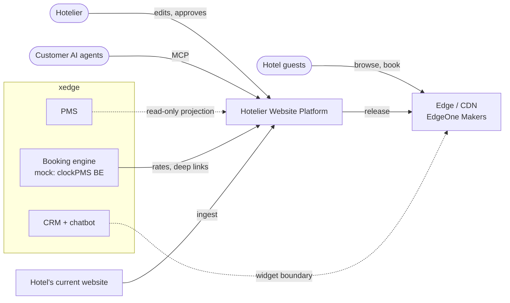
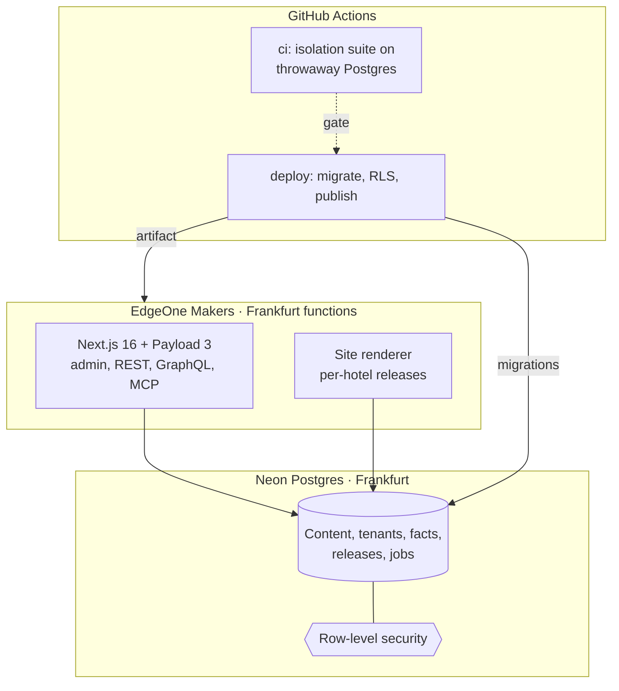
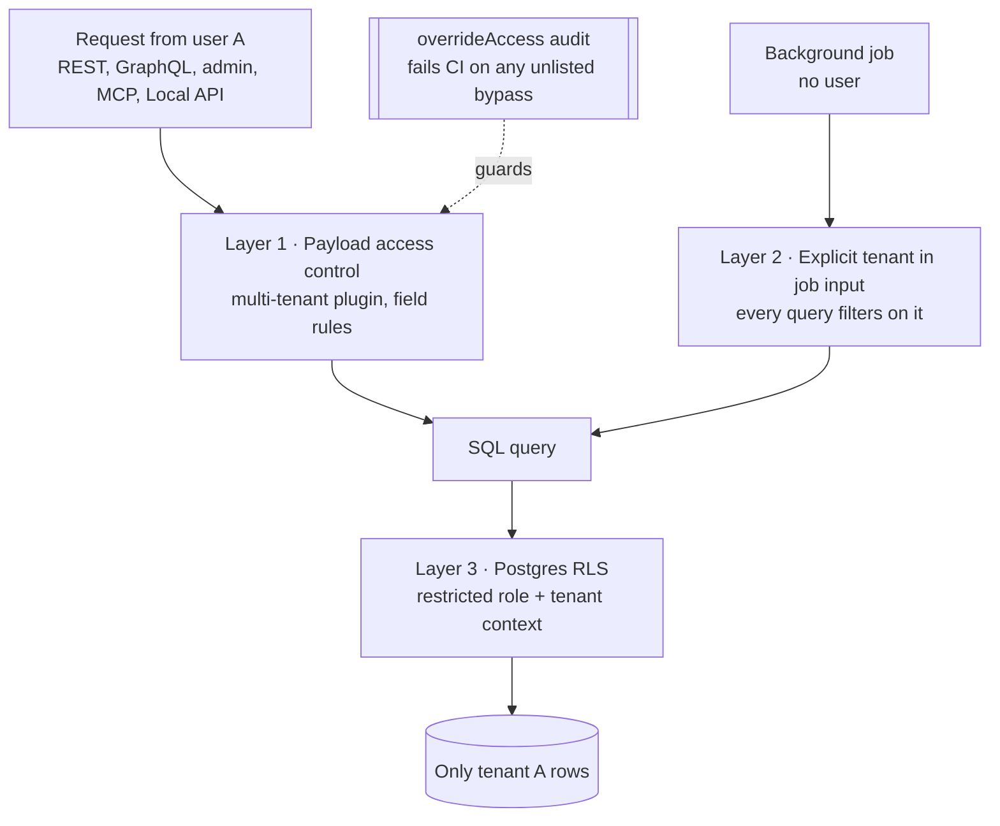
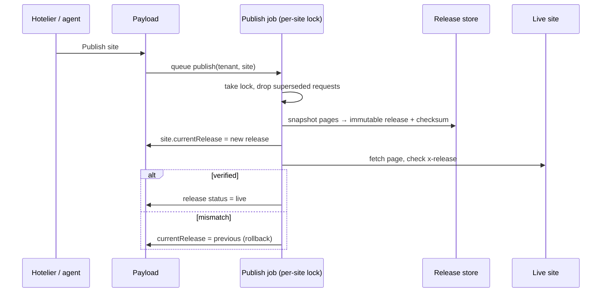
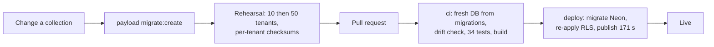

# System design, illustrated

How the Hotelier Website Platform fits together, as of 23 September 2026. Diagrams are Mermaid, so GitHub renders them and they are edited as text. Solid lines exist today; dotted lines are designed but not built. The spec is [`01-solution-definition.md`](01-solution-definition.md).

## 1. Context: who and what the platform talks to



The platform masters **content and releases only**. Inventory, rates, bookings and guest data stay in the other xedge systems and arrive as projections or embeds, under signed [contracts](contracts/).

## 2. Containers: what runs where



Code, database and functions all sit in the EU (Frankfurt). The application never talks to the host directly; only the `deploy` workflow and the release pipeline do (CLAUDE.md rule 5).

## 3. Tenant isolation: three layers, each tested



| Layer | Proven by | Status |
| --- | --- | --- |
| Access control | `isolation.int.spec.ts` (13), `isolation-extended` (bulk, imports), `rest-isolation` (REST, GraphQL, forged tenant cookie) | Enforced |
| Job tenancy | `isolation-extended` (jobs) | Enforced by pattern (`src/jobs/`) |
| RLS | `rls.int.spec.ts`, `rls-payload.int.spec.ts` (Payload queries held by RLS alone) | Evaluated; enforcing mode due in week 4 |

## 4. From an existing hotel website to a live site

```mermaid
flowchart LR
  S[Hotel website<br/>+ Google profile] -->|ingest spike| F[Facts<br/>unconfirmed]
  PMSx[PMS projection] -. .-> F
  F -->|hotel confirms,<br/>conflicts resolved| FC[Confirmed facts]
  FC -->|generation<br/>AI key pending| C[Draft content<br/>provenance: generated]
  C -->|studio edits| C2[Content<br/>provenance: human]
  C2 -->|publish| REL[Immutable release]
  REL --> LIVE[Live site]
  REL -. rollback = pointer move .-> LIVE
```

Nothing is generated from an unconfirmed fact, and only confirmed facts enter a release (built 23 September; generation waits for the AI model key). On customer zero the ingest found two conflicting check-out times and two phone numbers. The hotel settled them on 23 September: check-out is 11:00, and both numbers are current. See [`08-ingest-spike.md`](08-ingest-spike.md).

## 5. Releases: serialised, verified, reversible



Built as v0 on 23 September: a lease lock on the site row, a request sequence for superseding, and a stored snapshot served by `/s/<site>`. Why the lock matters: Makers queues concurrent deploys and **the last to finish goes live**, even if it is older (finding 17). The platform therefore serialises publishes itself. Design note: [`06-release-pipeline-design.md`](06-release-pipeline-design.md).

## 6. Schema change and code release



Rules learned the hard way: push is off for shared databases (it deleted the RLS policies), and Payload upgrades are one-way (the password-hash format changed in 3.90). Every Payload upgrade runs `scripts/upgrade-rehearsal.ps1`.

## 7. Where each concern lives in the repository

| Concern | Path |
| --- | --- |
| Collections (core) | `apps/platform/src/collections/` |
| Access rules and overrideAccess allowlist | `apps/platform/src/access/` |
| Background jobs (tenant in input) | `apps/platform/src/jobs/` |
| Database tools: RLS, fingerprint, checksums, backup/restore | `apps/platform/src/db/` |
| Migrations | `apps/platform/src/migrations/` |
| Ingest | `apps/platform/src/ingest/` |
| Host adapter (EdgeOne) | `apps/platform/src/host/` |
| Booking-engine adapter (mock clockPMS BE) | `apps/platform/src/booking/` |
| Release pipeline: publish, rollback, snapshot, checksum | `apps/platform/src/releases/` |
| Public renderer and booking step | `apps/platform/src/app/(sites)/s/[site]/` |
| Fact base: normaliser, import, owner decisions | `apps/platform/src/ingest/`, `src/collections/Facts.ts` |
| Hotel pack (types, blocks, schema.org) | `packs/hotel/`, planned |
| Rehearsal and deploy scripts | `scripts/` |
| CI and deploy | `.github/workflows/` |
