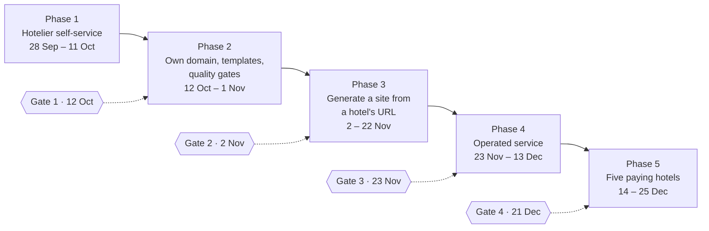

# Roadmap: the next phases

24 September 2026. This maps the 90-day plan ([`02-90-day-plan.md`](02-90-day-plan.md), the baseline) onto the product as it now stands: **a hotel marketing website, operated for the hotel, with no booking logic** (owner's decision, 24 September). Progress is ticked in [`CHECKLIST.md`](CHECKLIST.md); day-to-day state is in [`../HANDOFF.md`](../HANDOFF.md).

## Where we start

Done before the plan's day 1 (28 September): tenant isolation proven on production infrastructure, migrations, restore and upgrade rehearsed, CI and deploys from GitHub, the fact base, content releases with rollback, the hotel pack v0, and **customer zero's marketing website live and approved by the owner** ([screenshots](screenshots/README.md)).

## Phase 1 — Hotelier self-service (28 Sep – 11 Oct, plan weeks 1–2)

Goal: a hotelier changes and publishes their own site from the admin, without an engineer.

**Status, 24 September: done early**, except amenities as a type. Live as customer zero's release r4. What differs from the plan: photos are stored in Postgres (Neon Frankfurt) behind a storage adapter, not in object storage (docs/05 finding 28); the legal pages are drafts for the owner to validate. Evidence: [screenshots](screenshots/README.md), tests in `tests/int/self-service.int.spec.ts`.

| Deliverable | Done when |
| --- | --- |
| **Publish and roll back from the admin**: buttons on the site, list of releases, "View site" link | Customer zero republishes after an edit, from `/admin`, in under a minute |
| **Draft preview**: see a page before publishing | Preview link on each page |
| **Media pipeline v0**: upload photos to object storage (EU), resized variants, alt text required | Customer zero's photos served from our storage, not the old site |
| **Hotel pack v1**: offers, amenities as a type, policies, FAQ block | Offers and FAQ on customer zero's site |
| **Legal and consent**: legal notice, privacy page, cookie consent (none needed today: no trackers), accessibility statement | Pages present and linked from the footer |
| Hotelier accounts: the owner logs in as a tenant user, not super-admin | Owner account for customer zero |

## Phase 2 — Own domain, templates, quality gates (12 Oct – 1 Nov, weeks 3–5) · Gate 1 on 12 Oct

Goal: a site on the hotel's own domain, in a design that can change without touching content, checked automatically.

| Deliverable | Done when |
| --- | --- |
| **Gate 1: hosting decision.** Makers confirmed in writing by Tencent, or the Cloudflare EU fallback executed | Decision recorded; custom domain works on the chosen host |
| **Custom domain** for customer zero (DNS, verification, certificate), `/s/<site>` becomes `/` | `www` of a test domain serves the site with HTTPS |
| **Design contract and templates**: tokens, brand fields, contrast gates, self-hosted fonts ([`11-design-contract.md`](11-design-contract.md)) | **Done early (24 Sep)**: three templates (Maison, Atelier, Soirée); customer zero switchable with no content change |
| **Own domain serving**: the platform recognises the hotel from the domain; `/admin` only on our domain | Tested locally now, live with the test domain |
| **Speed**: published pages cached at the edge (EdgeOne KV, keyed by release so rollback stays instant) | Pages under 1 s from Paris (today about 2.2 s) |
| **Photo uploads from phones**: size cap or in-browser resize under the 6 MB function limit | A 12 MB phone photo uploads |
| **Plugins adopted**: Payload SEO, Redirects (old site URLs), Form Builder, Import/Export ([`12-strategy-decisions.md`](12-strategy-decisions.md)) | Each tenant-scoped and covered by the isolation tests |
| **Security basics**: edge rate limits on login and API, security headers, Dependabot and code scanning | Rules live; CI alerts on vulnerable dependencies |
| **Static map image** made at publish time instead of the live OpenStreetMap embed (GDPR) | No third-party request on public pages |
| **Quality gates in CI**: accessibility (axe, WCAG 2.2 AA), Lighthouse performance budget, structured-data validation | A failing page blocks the merge |
| Contact form (Form Builder; email through an EU provider, Scaleway TEM proposed), still no booking logic | Messages stored in the admin and reaching the hotel's inbox; spam protection (honeypot and rate limit, Friendly Captcha if needed) |

## Phase 3 — Generate a site from a hotel's URL (2 – 22 Nov, weeks 6–8) · Gate 2 on 2 Nov

Goal: onboarding a new hotel takes hours, not days. Needs the **AI model key**.

| Deliverable | Done when |
| --- | --- |
| **Ingest v1**: crawl, AI extraction of rooms, services and policies into facts, with sources | 80 % of customer zero's facts found without hand work |
| **Fact review screen** for the hotelier: confirm, correct or reject in one pass | Review of a new hotel's facts in under 15 minutes |
| **Generation**: pages and room types drafted from confirmed facts, marked "generated" | A first draft site in under 5 minutes |
| **Translation** to a second and third locale, with human-edit protection | EN/DE drafts from FR |
| **Brand proposal** by an agent (accent from the logo, template, fonts), approved by the hotel; a branding skill that packages the design contract | A new hotel's brand proposed in minutes, published only after approval |
| **Visual studio v0** (Puck on the same blocks): edit on the page, desktop first, then phone | A hotelier edits a page visually without the forms |
| Design partners 1–3 onboarded with it | Three hotels with a draft site |

## Phase 4 — Operated service (23 Nov – 13 Dec, weeks 9–11) · Gate 3 on 23 Nov

Goal: the platform keeps sites healthy without a human, and shows the hotel what it did.

| Deliverable | Done when |
| --- | --- |
| Scheduled checks: broken links, stale content, accessibility, performance | Run nightly per site, issues listed in the admin |
| Proposed fixes with one-tap approval | Hotelier approves a fix from the admin |
| **Monthly service report** per hotel | Sent to customers 1–3 |
| Agents over MCP with scoped keys edit drafts, never publish | Audit log shows agent edits |
| **Hotel dashboard**: site status, publish history, health, suggestions to approve, the monthly report | Home screen of the owner's admin |
| **Team dashboard**: all hotels with status, domain, last publish, health, open issues | Our daily view of the fleet |
| Error and uptime alerts (Sentry EU, per-site uptime), admin action log, backups with a restore drill | Alerts reach the team; restore rehearsed |
| RLS enforcing for live requests | Owner-role connections limited to migrations |

## Phase 5 — Five paying hotels (14 – 25 Dec, weeks 12–13) · Gate 4 on 21 Dec

| Deliverable | Done when |
| --- | --- |
| Five hotels live on their own domains, invoiced | Gate 4 |
| Human minutes per site per month measured | Number in the checklist metrics |
| Template upgrade to all sites (canary first) | One upgrade shipped without a content regression |
| Backups and single-tenant restore rehearsed in production | Rehearsal log |
| **Compliance before the first invoice**: data processing agreement with each hotel, providers list, processing register, breach procedure, external accessibility audit and penetration test | Documents signed; audit and test reports |

## Out of scope until the owner says otherwise

Booking logic, availability, rates, PMS integration (the parked adapter stays in `apps/platform/src/booking/`), self-serve signup, billing automation, verticals other than hotels.

## What the owner can unblock

| Action | Unblocks |
| --- | --- |
| Send the Tencent email | Gate 1, custom domains |
| AI model key | Phase 3 |
| Shortlist of hotels, first conversations | Design partners in Phase 3 |
| A test domain we may point at the platform | Custom-domain work in Phase 2 |
