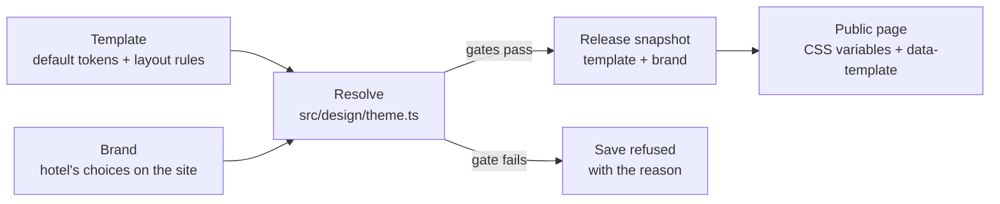

# Design contract: templates, brand and tokens

Status: v1, 24 September 2026. Code: `apps/platform/src/design/`, `apps/platform/src/app/(sites)/s/[site]/site.css`. Tests: `apps/platform/tests/int/design.int.spec.ts`.

This is the agreement that lets three kinds of author change how hotel sites look without breaking them: an engineer or designer building a **template**, a hotelier choosing a **brand**, and an agent proposing a brand for a new hotel. It implements the spec's rules in [`01-solution-definition.md`](01-solution-definition.md): theme separable from content, templates as versioned packages, contrast validated at token level, and no pixel canvas.

## 1. The three layers

| Layer | Who owns it | Where | Changes how |
| --- | --- | --- | --- |
| **Template** | Us (engineers, designers) | `src/design/templates.ts` (tokens) + `site.css` sections `[data-template='<id>']` (layout) | Code review and CI; a fix ships to every site on that template |
| **Brand** | The hotel | `sites.template` and the `sites.brand` group (accent, background, text, heading font, body font, corners), edited in the admin | Save in the admin, then publish; part of the release, so it can be rolled back |
| **Content** | The hotel | Pages, rooms, offers, facts, photos | Unchanged by this contract |

A template never contains a hotel's content, and a brand never contains layout. Switching template or brand changes no content.

## 2. Tokens

Every rule in `site.css` uses these custom properties; no fixed colour or font appears outside the `:root` fallback. The resolved values are set on the element carrying `data-template` (the page `<body>`, or the preview wrapper).

| Token | Meaning |
| --- | --- |
| `--hh-paper` | Page background |
| `--hh-card` | Cards (rooms, offers, facts, policies) |
| `--hh-tint` | Alternate sections, hero without photo |
| `--hh-ink` / `--hh-muted` | Body text / secondary text |
| `--hh-line` | Borders and dividers |
| `--hh-accent` | Brand colour: button fills, badges, underlines |
| `--hh-accent-ink` | Text on the accent (derived) |
| `--hh-accent-text` | The accent when used as text on backgrounds (derived) |
| `--hh-inverse`, `--hh-inverse-ink`, `--hh-inverse-muted` | Footer and call-to-action band |
| `--hh-focus` | Keyboard focus ring (derived) |
| `--hh-radius`, `--hh-radius-media`, `--hh-radius-button` | Corner radii for cards, photos, buttons (from the corners choice) |
| `--hh-serif`, `--hh-sans` | Heading and body font stacks (names kept from v0; either may be any allowed font) |
| `--hh-heading-weight`, `--hh-heading-tracking` | Set by the template's CSS section |

Interchange format: W3C Design Tokens (DTCG). `toDTCG()` exports a resolved theme; designers deliver a template's defaults in the same shape.

## 3. Gates: what can never be published

`resolveTheme()` derives what a hotelier should not have to think about, then checks every pair below. A brand whose pairs fail is refused at save with the reason; templates must pass with their own defaults (CI test).

| Pair | Minimum | How it is kept |
| --- | --- | --- |
| Text on background, cards, alternate sections | 4.5:1 | **Checked, refused if failing**: the only choice that can fail |
| Secondary text on the same | 4.5:1 | Derived from text and background, nudged toward the text colour until it passes |
| Accent as text (links, eyebrows, outline buttons) | 4.5:1 | Derived from the accent, nudged toward the text colour until it passes |
| Button text on the accent | 4.5:1 | White or black, whichever is stronger (every colour reaches 4.5:1 with one of them) |
| Footer text on the footer band | 4.5:1 | Template-defined, nudged if needed |
| Focus ring on background | 3:1 | Derived per scheme |

Evidence: the design test resolves 600 random accents per template and 400 random background/text pairs with no failing pair.

Other gates, per template, in CI (Phase 2 quality gates): accessibility checks (axe, WCAG 2.2 AA) and a performance budget on customer zero's pages in every template.

## 4. Fonts

- Only fonts in `FONT_IDS` (`src/design/templates.ts`): today Inter, Manrope, Playfair Display, Cormorant Garamond. All SIL Open Font License, Latin subset (French, English, German, Spanish, Italian), files and licences in `src/design/fonts/`.
- **Self-hosted only**, loaded with `next/font/local` from our own domain. No Google Fonts or other font CDN (a German court held that loading Google Fonts from Google's servers breaches GDPR without consent).
- Declared once for all templates; the browser downloads only the families a page uses.
- Adding a font: open licence, Latin subset, variable weight if available, add to `FONT_IDS`, `FONT_LABELS`, `fonts.ts`, and a migration for the brand font enums.

## 5. Blocks: what a template must style

Blocks render the same markup in every template (`src/site/Blocks.tsx`, pack renderers in `packs/hotel/src/render`). A template's CSS section may restyle these classes and change layout, never markup or content.

| Block | Classes a template must handle |
| --- | --- |
| Header | `.hh-header`, `.hh-brand-name`, `.hh-brand-tag`, `.hh-nav`, `.hh-burger`, `.hh-nav-mobile`, `.hh-btn.hh-header-cta` |
| Hero | `.hh-hero`, `.hh-hero--image` (photo + `.hh-hero-inner`), heading, `.hh-hero-sub`, `.hh-btn--light` |
| Sections | `.hh-section`, `.hh-section--tint`, `.hh-section-title`, `.hh-eyebrow`, `.hh-lead`, `.hh-split`, `.hh-link-arrow` |
| Features, gallery, quote, text, FAQ | `.hh-features`, `.hh-gallery`, `.hh-quote`, `.hh-prose`, `.hh-faq` |
| Call to action | `.hh-cta`, `.hh-cta--image` |
| Hotel pack | `.hh-room*`, `.hh-offer*`, `.hh-badge`, `.hh-policies` |
| Contact and map | `.hh-contact`, `.hh-facts`, `.hh-map` |
| Footer | `.hh-footer*`, `.hh-footer-legal` |

Accessibility rules every template keeps: one `h1` per page (first hero), visible focus (`--hh-focus`), text over photos only on a darkening overlay, touch targets at least 24 px (WCAG 2.2 AA) and 44 px for primary buttons, no information by colour alone, `prefers-reduced-motion` respected for any animation.

## 6. Templates today

| Id | Name | Scheme | Fonts | Corners | Character |
| --- | --- | --- | --- | --- | --- |
| `maison` | Maison | light | Cormorant Garamond / Inter | soft | Classic and warm: cream, serif headings, full-width photo hero. Default; customer zero's look |
| `atelier` | Atelier | light | Manrope / Inter | square | Modern and minimal: white, sans-serif, photo beside the headline, uppercase labels, accent call-to-action band |
| `soiree` | Soirée | dark | Playfair Display / Inter | soft | Dark and elegant: night palette, gold accent, centred italic headlines, outline buttons |

Built by engineering on 24 September as the first set; a designer will add and refine templates within this contract.

## 7. Who does what

| Author | Does | Never |
| --- | --- | --- |
| **Designer** | Designs new templates (Figma variables exported as DTCG), within the token list and block classes above | Hard-codes colours or fonts; changes markup per template |
| **Engineer** | Adds the template: tokens in `templates.ts`, a CSS section, a version, screenshots, the tests | Ships a template that fails the gates |
| **Hotelier** | Picks a template, sets an accent, optionally background/text colours, fonts and corners; previews; publishes | — (the gates make the unsafe choices impossible) |
| **Agent** (Phase 3) | Proposes a brand for a new hotel: accent from the logo, a template that fits the photos, fonts from the allowed list; shows the preview | Publishes a theme change: the spec requires explicit approval for theme changes |

A future **skill** packages sections 2–7 for agents, with one tool that writes a brand as a proposal.

## 8. Versioning and upgrades

- Each template has a `version`. A change to a template's CSS or defaults bumps it and is visible on every site using it at its next render; releases store the template id and brand, not the CSS. This is intended: template fixes reach all sites (spec: "evergreen by construction").
- A breaking visual change becomes a new template id rather than a silent change to an existing one.
- Old releases (before templates existed) render as `maison` (`upgradeSnapshot`).
