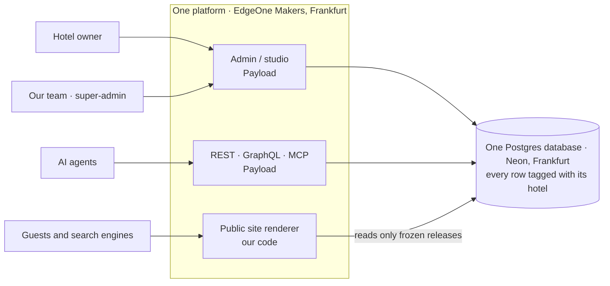

# How the platform works

For anyone joining the project: the owner, an engineer, a designer or an AI agent. It explains in plain words what this Payload project is, the words we use, what happens when someone edits or visits a site, and where everything lives. Deeper material: [`09-system-design.md`](09-system-design.md) (diagrams), [`12-strategy-decisions.md`](12-strategy-decisions.md) (why), [`../HANDOFF.md`](../HANDOFF.md) (where things stand).

## 1. In one paragraph

We run **one** website platform for many hotels. It is a single **Payload CMS** application (on Next.js) with a single **Postgres** database. Every hotel is a **tenant** inside it: its own users, pages, rooms, offers, photos and facts, kept apart from every other hotel's by the code and again by the database. A hotel edits its content in the **admin** (the studio), then **publishes**: the platform freezes a checked copy of the site (a **release**), and that frozen copy is what guests see, on the hotel's own domain, in the hotel's chosen **template** and **brand**. There is no separate installation per hotel: adding a hotel means adding rows, not servers.

## 2. The words we use

| Word | Meaning | Where in the code |
| --- | --- | --- |
| **Tenant** | One customer (a hotel or a hotel group). Owns users, sites and all their content | `collections/Tenants.ts`; the multi-tenant plugin adds a `tenant` field everywhere |
| **Site** | One website of a tenant: name, languages, template, brand, header button, current release. A tenant can have several sites | `collections/Sites.ts` |
| **Page** | A page of a site, made of **blocks**, with drafts and versions | `collections/Pages.ts` |
| **Block** | A building piece of a page: hero, text and image, features, gallery, FAQ, map… Hotels arrange blocks; they cannot draw freely | `collections/Pages.ts` (core blocks), `packs/hotel/src/blocks.ts` (hotel blocks) |
| **Pack** | A bundle that adds an industry's concepts without touching the core. The **hotel pack** adds room types, offers, the rooms/offers/policies blocks and schema.org Hotel | `packs/hotel/` (`@hh/pack-hotel`), loaded by `src/packs.ts` |
| **Fact** | One piece of information about the hotel (phone, check-in time, star rating), with its source. Born unconfirmed; only confirmed facts reach guests | `collections/Facts.ts`, `src/ingest/` |
| **Release** (snapshot) | A frozen, checksummed copy of everything a site shows: published pages, confirmed facts, pack data, template and brand. Never edited after creation | `collections/Releases.ts`, `src/releases/` |
| **Publish / roll back** | Publish creates a new release and makes it live; rollback points the site back to the previous release (about a second) | `src/releases/publish.ts`, the Website panel in the admin |
| **Preview** | See a draft page with the site's design before publishing (signed-in users only) | `app/(sites)/preview/` |
| **Template** | A shared look (Maison, Atelier, Soirée): default colours, fonts, corners and layout rules. Changing a template changes every site using it | `src/design/templates.ts`, `site.css` |
| **Brand** | A hotel's own choices on top of a template: accent colour, optional background and text colours, fonts, corners | `sites.brand`, resolved by `src/design/theme.ts` |
| **Token** | A named design value (`--hh-accent`, `--hh-paper`…). Templates use only tokens, never fixed colours | [`11-design-contract.md`](11-design-contract.md) |
| **Media** | Photos. Uploaded once, resized to WebP, stored in the database, served at `/media/…` | `collections/Media.ts`, `src/media/` |
| **Owner / super-admin** | A hotel's owner account sees only its tenant; super-admins (our team) see all | `collections/Users.ts`, `src/access/` |
| **Domain** | A hostname for a site. The hotel adds it in the admin and a CNAME at its DNS provider; our team marks it verified; the site then answers at `/` on that domain and `/admin` stays on ours | `collections/Domains.ts`, `src/proxy.ts`, `app/(sites)/h/` |
| **Redirect** | An old address of the hotel's previous website (`/chambres.html`) sent to a page of the new one, so links and rankings survive. Part of the release | `redirects` collection (Payload plugin), `redirectFor` in `src/site/render.tsx` |
| **Form / submission** | A contact form built in the admin (Website → Forms) and placed on a page with the form block. Messages land in Form submissions, per hotel, and go by email once SMTP is set | `forms`, `form-submissions` (Payload plugin), `src/forms/contactEndpoint.ts`, `src/site/FormBlock.tsx` |
| **SEO fields** | Title, description and share image per page, filled by the hotel or generated | `meta` group on pages (Payload SEO plugin) |
| **Quality gates** | Automatic checks on every push: accessibility, structured data and page weight for every template | `tests/quality/gates.mjs` |
| **RLS** | Row-level security: the database itself refuses cross-tenant rows | `src/db/rls.sql` |
| **Migration** | A versioned change to the database structure, applied in order everywhere | `src/migrations/` |
| **Onboarding content** | A hotel's site written as code, applied in every language and published by a script (used for customer zero) | `src/onboarding/` |

## 3. What happens when…

**A hotelier edits and publishes.** They sign in to `/admin` (owner account, their hotel only), edit a page, press Preview to see the draft in the site's design, then press **Publish site** in the Website panel. The release pipeline takes a lock on the site, builds the snapshot (published pages, confirmed facts, rooms and offers, template and brand), stores it with a checksum, points the site at it and checks it is live. **Undo last publish** points back to the previous release.

**A guest visits.** The page is rendered from the site's current release only; drafts, unconfirmed facts and other hotels' data cannot appear. The page gets the template's layout, the brand's colours and fonts (self-hosted), structured data for Google (Hotel, FAQ), a sitemap and language alternates. On the hotel's own domain the same page answers at `/` and the admin is not reachable there. A visitor who sends the contact form posts to `/api/contact`; the message is stored under the hotel and emailed when a mail provider is configured.

**We onboard a hotel** (today by engineering, Phase 3 by agent). Create the tenant and site; import facts from the hotel's current website (confirmed by the hotel or, for the demo, by us); write or generate pages; import photos; choose a template and brand; create the owner account; publish; connect the domain.

**We improve a template.** Change its tokens or its `[data-template]` CSS section, run the design tests, deploy. Every site on that template gets the change at its next render, without republishing, because releases store the template's name, not its CSS.

**We add a feature.** Industry-neutral features go in the core (`apps/platform/src`); hotel concepts go in the hotel pack. A Payload plugin is fine if it is tenant-scoped and only helps people write: anything guests see must come from the release ([`12-strategy-decisions.md`](12-strategy-decisions.md) §3). Database changes are migrations, rehearsed on 51 tenants before they reach Neon.

## 4. What Payload gives us, and what we built

| Payload (the framework) gives | We built on top |
| --- | --- |
| The admin interface, users and login, roles | Owner accounts, the Website panel (publish, undo, releases), preview |
| Collections, fields, drafts and versions, localisation | The content model, the hotel pack, blocks for hotel sites |
| REST and GraphQL APIs, the MCP server for agents | Isolation rules and tests across all of them, the `overrideAccess` audit |
| Uploads and image resizing | Photo storage in Postgres, public `/media` route, import from a hotel's old site |
| Migrations, plugins (multi-tenant, MCP, cloud storage) | Row-level security, per-tenant migration checks, restore of one hotel |
| — | The release pipeline, the public site renderer, templates and the design contract, facts and ingest, onboarding |

## 5. Where things are

| Path | What it holds |
| --- | --- |
| `apps/platform/` | The whole application (Next.js + Payload) |
| `apps/platform/src/collections/` | Core content types: users, tenants, sites, pages, media, domains, releases, facts |
| `apps/platform/src/app/(payload)/` | The admin and APIs (generated by Payload) |
| `apps/platform/src/app/(sites)/` | Public sites (`/s/<site>/…`), previews, sitemap, robots |
| `apps/platform/src/site/` | The renderer: blocks, header, footer, routing, theme attributes |
| `apps/platform/src/design/` | Design contract in code: templates, theme resolution, colour maths, fonts |
| `apps/platform/src/releases/` | Snapshots, publish, rollback, verification |
| `apps/platform/src/admin/` | Custom admin components (Website panel) |
| `apps/platform/src/media/`, `src/app/media/` | Photo storage adapter and public photo route |
| `apps/platform/src/ingest/`, `src/onboarding/` | Facts from a hotel's website; a hotel's site as content; photo import; owner accounts |
| `apps/platform/src/db/`, `src/migrations/` | Row-level security, tenant checks and backups; database migrations |
| `apps/platform/src/access/` | Access rules and the `overrideAccess` allowlist |
| `apps/platform/src/booking/` | Parked booking-engine adapter (no booking on sites, owner's decision) |
| `apps/platform/tests/` | Integration tests (`int/`) and screenshot scripts (`visual/`) |
| `packs/hotel/` | The hotel pack |
| `scripts/` | Rehearsals (migration, restore, upgrade), deploy, vendoring packs for Makers |
| `.github/workflows/` | `ci` on every push; `deploy` by hand |
| `docs/` | Everything written; `docs/README.md` is the index |
| `templates/`, `packages/` | Reserved folders from the original layout. Templates currently live in `apps/platform/src/design/` |

## 6. Questions people ask

**Is every hotel its own Payload installation?** No. One Payload, one database; each hotel is a tenant. A dedicated installation could be sold later as a premium option on the same code.

**Can a hotel break its design?** No. It chooses a template and a few brand values; colours that would make text unreadable are adjusted automatically, and the one unsafe choice (text too close to the background) is refused with the reason.

**Can we use Payload plugins?** Yes, if they are tenant-scoped and help people write. What guests see always comes from the frozen release. The adopted list is in [`12-strategy-decisions.md`](12-strategy-decisions.md).

**Where do SEO and AEO live?** In the release: titles, descriptions, schema.org, sitemaps, language alternates. AEO (being quoted by AI assistants) is the same data kept clean and consistent, plus `llms.txt` later.

**Where is the data?** Neon Postgres and EdgeOne functions, both in Frankfurt. No cookies or trackers on public pages; fonts and photos served from our own domain.

**What happens if we change host?** The code does not depend on EdgeOne: hotels point a CNAME at a name we control, so a move changes our name, not theirs. EdgeOne-specific features sit behind adapters.

**Who can publish?** The hotel's owner (for their hotel only), our super-admins, and the onboarding scripts. Agents can draft but never publish.

**Does a designer need to write code?** No: a designer delivers a design within the contract; an engineer (or a coding agent) implements it. See [`14-designer-brief.md`](14-designer-brief.md).

## 7. Which document to read

| You are | Read |
| --- | --- |
| The owner | [`../HANDOFF.md`](../HANDOFF.md) (state and next actions), [`CHECKLIST.md`](CHECKLIST.md), [`10-roadmap-phases.md`](10-roadmap-phases.md), [`12-strategy-decisions.md`](12-strategy-decisions.md) |
| An engineer or coding agent | This page, [`../CLAUDE.md`](../CLAUDE.md) (rules), [`09-system-design.md`](09-system-design.md), [`06-release-pipeline-design.md`](06-release-pipeline-design.md), [`11-design-contract.md`](11-design-contract.md) |
| A designer | [`14-designer-brief.md`](14-designer-brief.md), then [`11-design-contract.md`](11-design-contract.md) and [`screenshots/`](screenshots/README.md) |
| Giving work to an AI agent or a designer | [`prompts/`](prompts/README.md): ready-to-use example prompts |
| Evaluating hosting | [`04-edgeone-makers-evaluation.md`](04-edgeone-makers-evaluation.md), [`05-week1-spike-results.md`](05-week1-spike-results.md), [`outreach/`](outreach/) |
| Reviewing the product | [`01-solution-definition.md`](01-solution-definition.md) (the spec), [`02-90-day-plan.md`](02-90-day-plan.md) (the baseline plan) |
